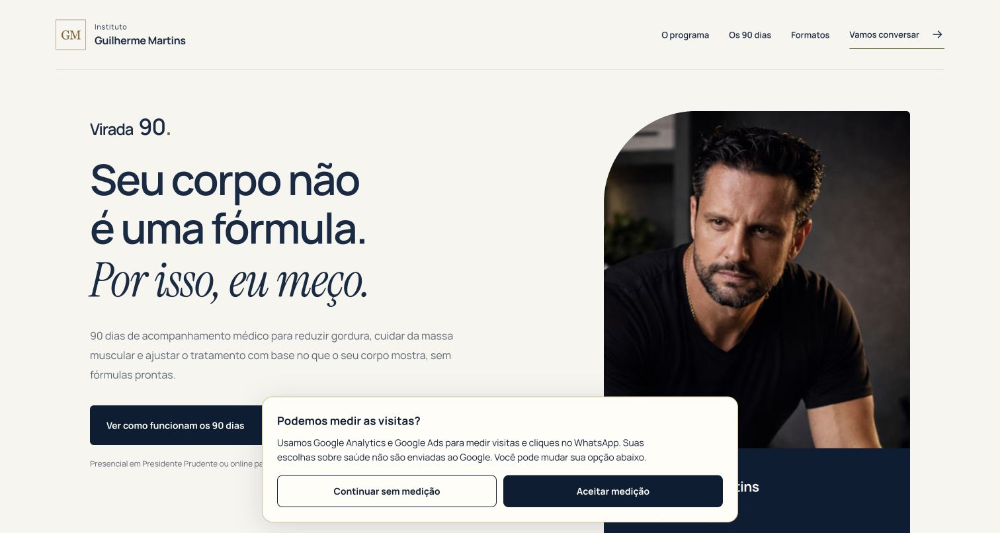

# Publicação da medição Virada 90 — 03/10/2026

- [PR #76](https://github.com/vitormilanez/instituto-vivance/pull/76) mesclado.
  Commit publicado da aplicação: `a97f94dba94f9016db0a8d2a153eaad68cd3cc23`.
- CI do PR `37132282721` e [release da main `37132467559`](https://github.com/vitormilanez/instituto-vivance/actions/runs/37132467559)
  aprovados: 424 testes, lint, typecheck e build. Etapas efetivas de migrations,
  Edge Functions e promoção automática ficaram skipped por configuração
  protegida ausente. Não havia mudança de banco neste lote.
- Conta CLI `vtrconsulting`; equipe `vtr-consulting`, projeto
  `instituto-vivance`, ID `prj_ligeZuFRycRXA21u5rRzaLAORTrI`, raiz `apps/web`,
  Node 24. Projeto/equipe confirmados antes da promoção.
- Deployment Git do mesmo SHA, `dpl_GG3xheoUfPTYcjjoxfCz2kHbxVxy`,
  `https://instituto-vivance-ir00p0ptc-vtr-consulting.vercel.app`,
  `READY`, target production, funções `gru1`. Promoção manual executada após
  a verificação da main; não houve build manual duplicado.
- Ambos os domínios inspecionados no mesmo deployment. Domínio principal
  responde 200; secundário retorna 307 para ele. Três leituras de `/login`
  em cada domínio passaram, sem tag da campanha no HTML.
- `/virada90`, `/virada90/conhecer`, os dois JS de medição, CSS e JS da
  apresentação responderam 200 e corresponderam byte a byte ao checkout.
  [Resultados HTTP](http-checks.json), [etapas do release](release-checks.json).
- Deployment anterior para reversão: `dpl_51T4TDH34NRadvymSWK3XbCBsm5x`,
  `https://instituto-vivance-o2esqz3ym-vtr-consulting.vercel.app`.

## Navegador e limites

No domínio oficial, o navegador mostrou aviso de medição. Antes do aceite,
o DOM continha somente os scripts locais; após aceitar, apareceu o SDK
`https://www.googletagmanager.com/gtag/js?id=G-L8QMHVRV68`. Não houve erro
nos logs do navegador consultados. A apresentação abriu, navegou ao tópico
final e preservou valores. Ao retirar o aceite, recarregou e deixou de carregar
o SDK. Sem rolagem horizontal no enquadramento desktop.

O enquadramento de 390 px foi conferido localmente, incluindo as duas opções
de consentimento. A abertura efetiva da mensagem preparada no WhatsApp foi
testada no domínio local, onde Google está desabilitado, sem envio de mensagem.
Nenhum CTA de WhatsApp foi acionado em produção após consentimento, evitando
fabricar conversão Ads durante a verificação. A composição dos eventos e
destino de conversão foi verificada nos testes com adaptador sintético.

Recebimento de evento no GA4/Google Ads, associação à campanha e configuração
primária/secundária não foram validados na conta Google. Um clique não confirma
conversa recebida. Pulse `/integration` oferece Webhooks de mensagens e widget
com origem; nenhuma integração foi criada. [Contrato e próximo slice](../../MEDICAO_GOOGLE.md).

Não foram alteradas rotas clínicas, permissões, dados ou migrations. Não houve
percurso clínico autenticado neste lote público; Gate P e aceite clínico
continuam separados desta publicação técnica.
